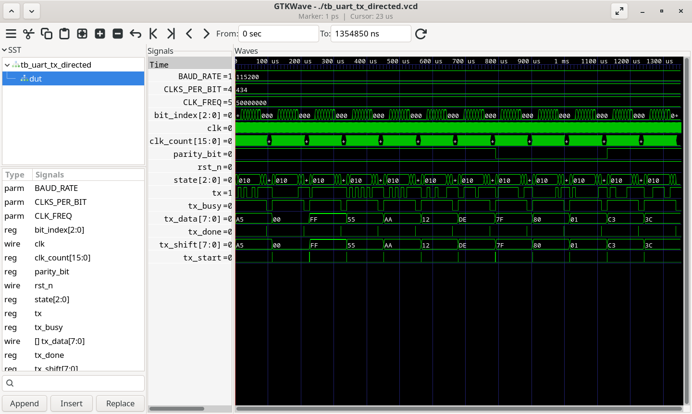
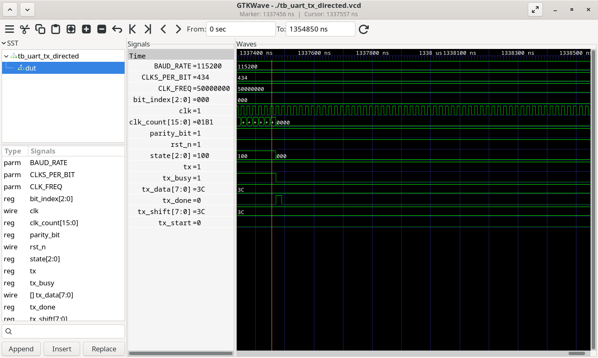
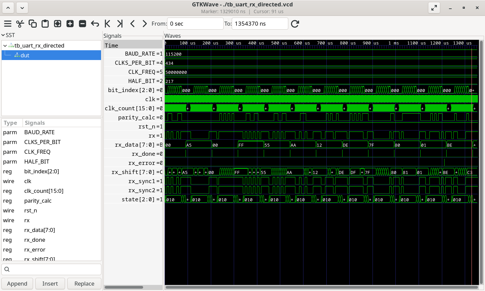
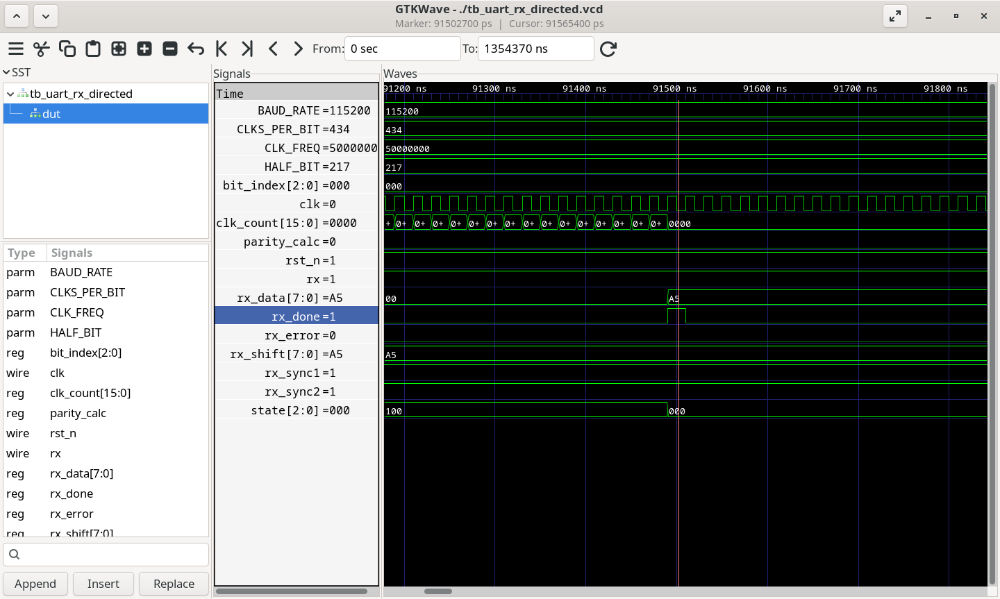
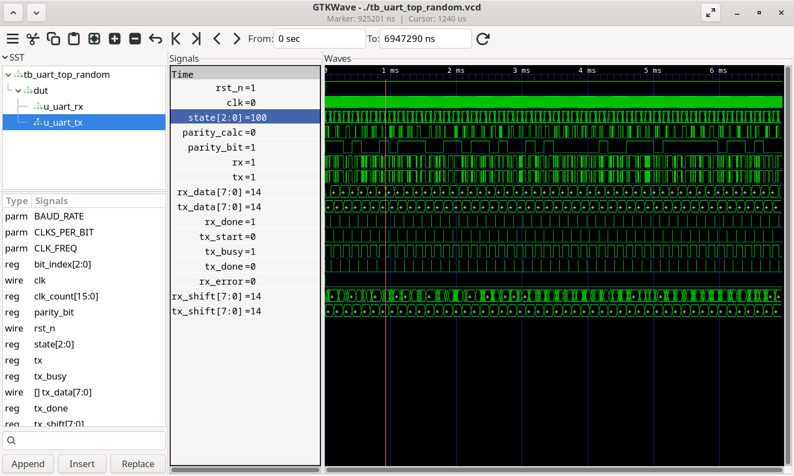
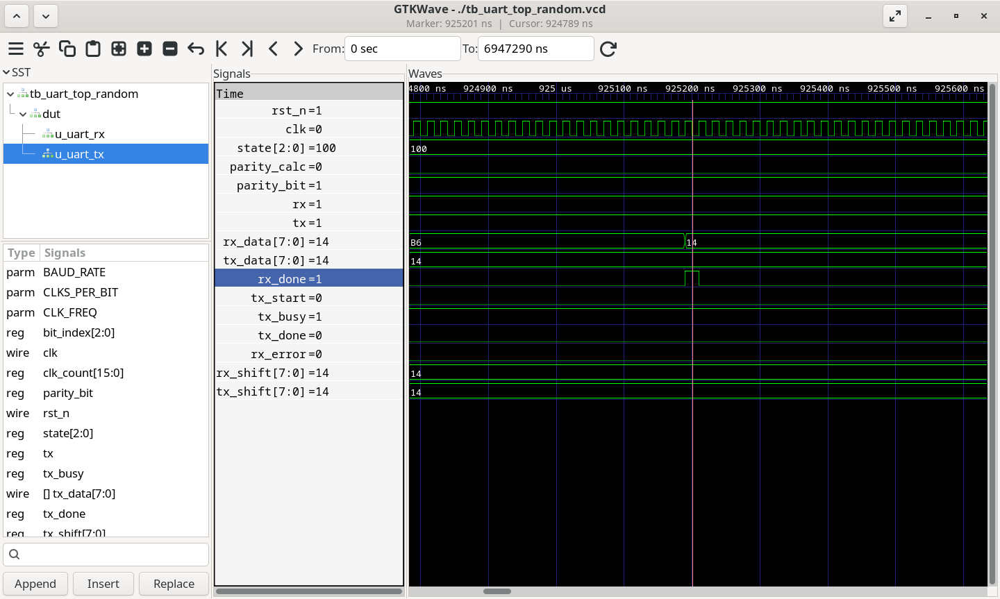
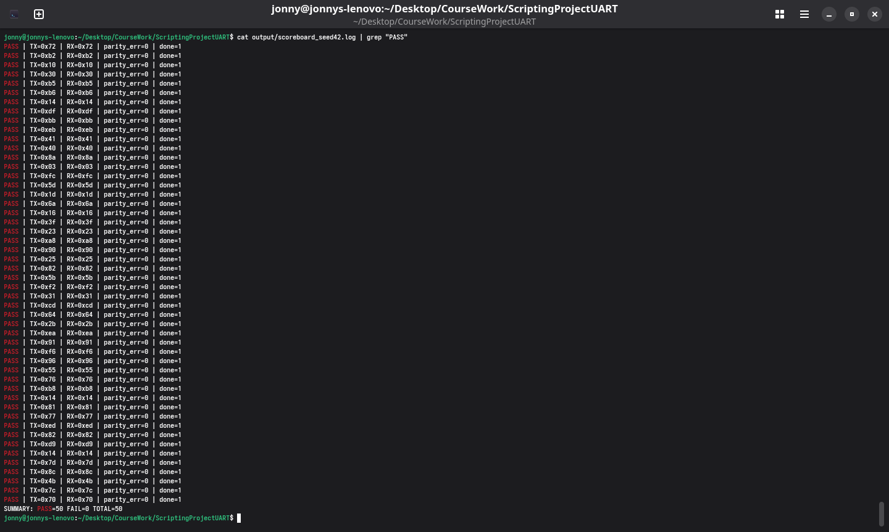
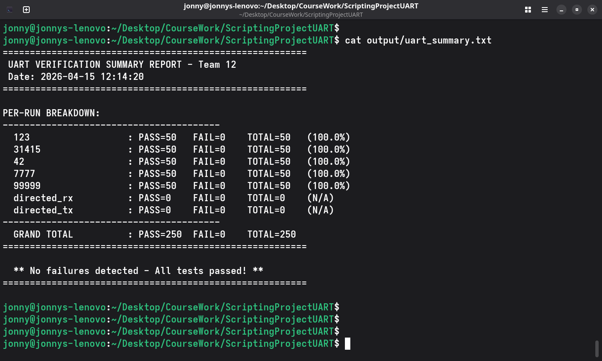
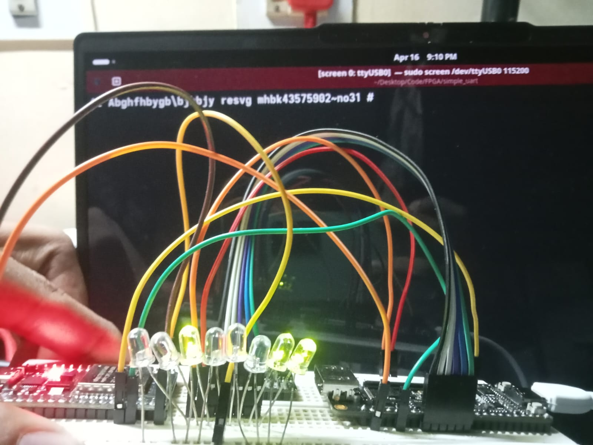

{width="6.5in" height="1.9444444444444444in"}

Submitted by Tanay Ashwath (24BVD0086), Purti Sachin Badole (24BVD0197),
Jonathan Gerard (24BVD0198) and Nakul Kulkarni (24BVD0214)

## Faculty: Dr. Jyothishman Saikia (SENSE)

# Implementation

### 1. Hardware Module Implementation (DUT)

The hardware is designed as a modular system where the transmitter and
receiver operate independently but share a common timing logic based on
the *BAUD_RATE*.

#### **UART Transmitter (*uart_tx.sv*)**

The transmitter is implemented as a *single-block FSM* to avoid timing
delays between state transitions.

-   **Timing Control**: It uses a local parameter *CLKS_PER_BIT* (System
    > Clock / Baud Rate) to determine how many clock cycles each serial
    > bit must be held.

-   **FSM States**:

    -   *IDLE*: Waits for the *tx_start* pulse.

    -   *START*: Drives the *tx* line low for one baud period.

    -   *DATA*: A loop transmits 8 data bits *LSB-first* by incrementing
        > a *bit_index*.

    -   *PARITY*: Calculates and sends an *odd parity bit* (*parity_bit
        > \<= \~(\^tx_data)*) for error detection.

    -   *STOP*: Drives the line high, signals *tx_done*, and returns to
        > *IDLE*.

#### **UART Receiver (*uart_rx.sv*)**

The receiver is designed for high reliability in asynchronous
environments.

-   **Clock Domain Synchronization**: To prevent metastability from the
    > asynchronous *rx* input, it utilizes a *double-flop synchronizer*
    > (*rx_sync1* and *rx_sync2*).

-   **Oversampling**: It uses a *HALF_BIT* parameter to find the center
    > of each incoming bit. The receiver waits for the midpoint of the
    > *START* bit before it begins shifting in data to ensure it samples
    > in the most stable region of the signal.

-   **Validation**: It reconstructs the byte in *rx_shift* and asserts
    > *rx_error* if the received parity or stop bit is invalid.

#### **UART Top-Level (*uart_top.sv*)**

-   **System Integration**: This module instantiates both *u_uart_tx*
    > and *u_uart_rx*.

-   **Loopback Logic**: For verification, the transmitter\'s output
    > (*tx_line*) is often wired directly to the receiver\'s input
    > (*rx_line*) to allow the system to self-test its full data path.

### 2. Testbench Implementation

The verification strategy uses a mix of individual block testing and
top-level randomized testing.

#### **Directed Testbenches (*tb_uart_tx_directed.sv, tb_uart_rx_directed.sv*)**

-   **TX Verification**: Employs a *send_and_capture* task that monitors
    > the *tx* line, waits for a *negedge* (start bit), and reconstructs
    > the byte to verify against golden data.

-   **RX Error Injection**: Specifically tests the DUT\'s robustness by
    > using an *inject_parity_err* flag to purposefully send a corrupted
    > frame and confirm the *rx_error* signal triggers correctly.

#### **Random Testbench (*tb_uart_top_random.sv*)**

This environment uses *SystemVerilog Object-Oriented Programming (OOP)*.

-   **Transaction Class**: Randomizes 8-bit data patterns using
    > *\$urandom_range(0, 255)*.

-   **Scoreboard Class**: Automates the checking process. It compares
    > the *sent_data* with the *rx_data_out* and logs the status
    > (*"PASS\"* or *\"FAIL\"*) into a unique seed-based log file e.g.,
    > *scoreboard_seed123.log*.

### 3. Automation Scripts

Automation is handled by two distinct scripts to manage the simulation
and results analysis.

#### **TCL Script (run.tcl)**

-   **Simulation Flow**: Automates the compilation of all SystemVerilog
    > files and launches the simulator.

-   **Dynamic Testing**: It allows passing a *seed* value as a
    > command-line argument (*+seed=%0d*) which is parsed and then send
    > to the random testbench to initialize the random number generator,
    > allowing for repeatable debugging of specific failed cases.

#### 

#### **Perl Script (report.pl)**

-   **Data Aggregation**: This script scans the project directory for
    > all generated *.log* files.

-   **Reporting**: It parses the scoreboard results using regular
    > expressions to count every *PASS* and *FAIL* entry. Finally, it
    > generates the *uart_summary.txt*, providing a grand total pass
    > rate across all directed and random test runs.

# Results and Takeaways

#### 1. Simulation Waveform Analysis

The functionality of the individual modules and the integrated system
was verified using ModelSim/QuestaSim. The following waveforms
demonstrate the timing accuracy of the UART protocol.

-   **UART TX Functionality**: The waveform shows the transition from
    > IDLE to START (logic low), followed by 8 data bits, the calculated
    > odd parity bit and the STOP bit (logic high).\
    > {width="6.5in"
    > height="3.888888888888889in"}

> {width="6.5in"
> height="3.888888888888889in"}

-   **UART RX Robustness**: The receiver successfully synchronizes with
    > the incoming serial line and samples at the HALF_BIT center.\
    > {width="6.5in"
    > height="3.888888888888889in"}

> {width="6.5in"
> height="3.888888888888889in"}

-   **System Loopback**: In the top-level random test, we observe
    > tx_line directly driving rx_line.\
    > {width="6.5in"
    > height="3.888888888888889in"}

> {width="6.5in"
> height="3.888888888888889in"}

####  

#### 2. Scoreboard & Regression Results

To ensure the design is robust against various data patterns, we ran a
regression suite with multiple random seeds.

-   **Randomized Testing**: Each run performed 50 unique transactions.
    > The scoreboard automatically compared the transmitted vs. received
    > data.\
    > {width="5.765965660542432in"
    > height="3.4531255468066493in"}

-   **Verification Summary**: Our Perl script aggregated all results
    > into a final report, confirming a **100% Pass Rate** across 250
    > total
    > tests.{width="5.813380358705162in"
    > height="3.307292213473316in"}

#### 3. Key Takeaways & Conclusion

-   **Timing Accuracy**: The implementation of *CLKS_PER_BIT* and
    > *HALF_BIT* sampling proved essential for preventing bit-slip and
    > ensuring data integrity at 115200 baud.

-   **Synchronization**: The use of double-flopping in the receiver
    > (*rx_sync1, rx_sync2*) successfully mitigated metastability risks,
    > which is a critical requirement for asynchronous communication.
    > This is a new technique we learned as we progrtessed through
    > creating this project.

-   **Automation Efficiency**:

    -   The TCL script reduced the code-to-simulation time significantly
        > by automating the compile and run phases.

    -   The Perl script transformed raw log data into a professional
        > summary, making it easy to identify that all random seeds
        > passed without manual inspection.

-   **Verification Depth**: By combining directed tests for parity error
    > injection with random tests for data coverage, we achieved a high
    > degree of confidence in the RTL\'s reliability.

# Proof of Implementation

Main Software Project:

[[https://drive.google.com/drive/folders/1z74PjjyCShaFHXlaxDTLvOeAtvx_SEZ2?usp=sharing]{.underline}](https://drive.google.com/drive/folders/1z74PjjyCShaFHXlaxDTLvOeAtvx_SEZ2?usp=sharing)

Hardware Demo:\
[[https://github.com/segfault610/simple_uart]{.underline}](https://github.com/segfault610/simple_uart)

{width="6.171875546806649in"
height="4.635528215223097in"}

# Individual Work

## Tanay:

Designed the testbench *tb_uart_tx_directed.sv* for directed testing of
the tx DUT and the tcl script *run_all_tests.tcl* for running his and
all other testbenches.

## Purti:

Designed the testbench *tb_uart_rx_directed.sv* for testing the tx_DUT
and the perl script *parse_scoreboard.pl*

## Nakul:

Designed the *uart_rx.sv* and *uart_tx.sv* DUTs.

## Jonathan:

Designed the *uart_top.sv* top-level DUT and the *tb_uart_random.sv*
seeding testbench.
